# 自动化巡检功能操作手册

适用版本：`v3.6.16`
适用模块：自动化巡检 / 巡检配置 / 巡检总览
编写时间：2026-06-19

## 1. 功能定位

自动化巡检用于把 Kafka 积压、海康接口取数、FTP 文件数量、服务器目录、磁盘空间、TCP 端口和服务状态等检查动作，抽象成可复用的巡检工具。用户可以把多个工具编排成巡检模板，再配置巡检计划定时执行，最终形成巡检记录、看板图表和导出报告。

它解决的问题是：巡检脚本分散、检查目标写死、阈值调整需要改代码、巡检结果难追溯、多人交接时不知道每个检查项如何配置，以及服务器账号和巡检账号混用导致的安全风险。

核心关系如下：

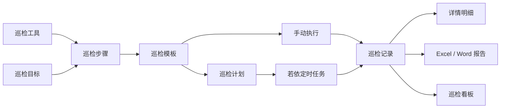

## 2. 权限说明

拥有 `datafusion` 权限字符的用户，默认具备自动化巡检相关权限。常用细分权限如下：

| 操作 | 权限字符 |
| --- | --- |
| 查看巡检记录和配置 | `support:autoInspection:query` |
| 维护巡检模板 | `support:autoInspection:template` |
| 维护巡检计划 | `support:autoInspection:plan` |
| 手动执行巡检 | `support:autoInspection:run` |
| 导出巡检结果 | `support:autoInspection:export` |
| 查看巡检密码明文 | `support:credential:viewPlain` |

如果页面按钮不可见，优先检查用户角色是否绑定了对应菜单权限；如果用户拥有 `datafusion` 权限字符，后端会按现场融合体系放行。

## 3. 页面入口

登录系统后，在左侧菜单进入：

- `自动化巡检` -> `巡检配置`
- `自动化巡检` -> `巡检总览`

`巡检配置` 负责维护模板和计划；`巡检总览` 负责查看结果、展开看板和导出报告。

## 4. 巡检配置总览

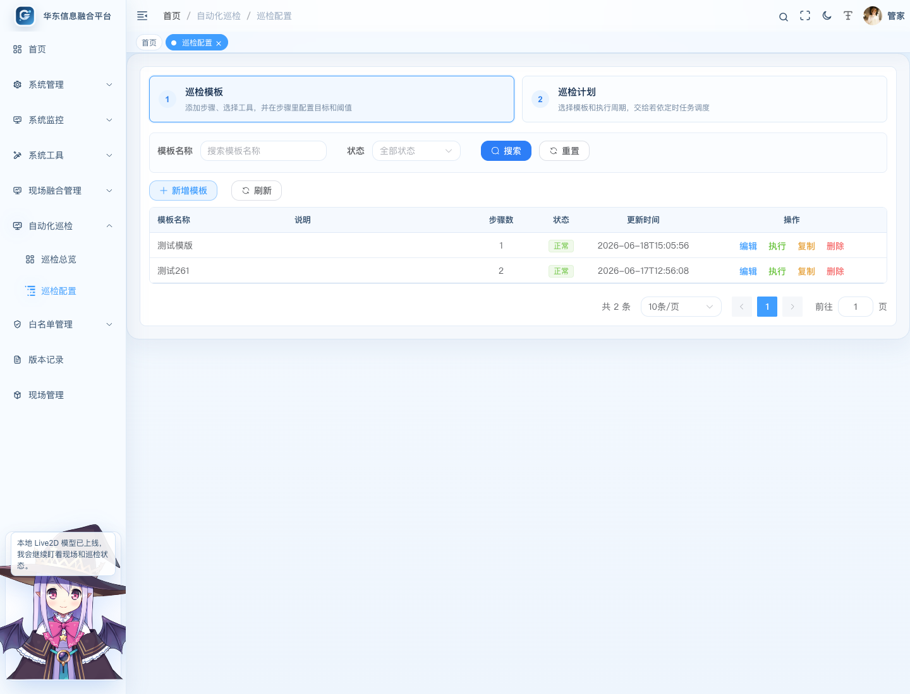

巡检配置页面分为两个区域：

| 区域 | 用途 |
| --- | --- |
| 巡检模板 | 创建可复用的巡检方案，一个模板可以包含多个巡检步骤。 |
| 巡检计划 | 为模板配置执行周期，并交给若依定时任务调度。 |

页面右侧提供“操作指引”入口，适合新用户按步骤完成第一次配置。

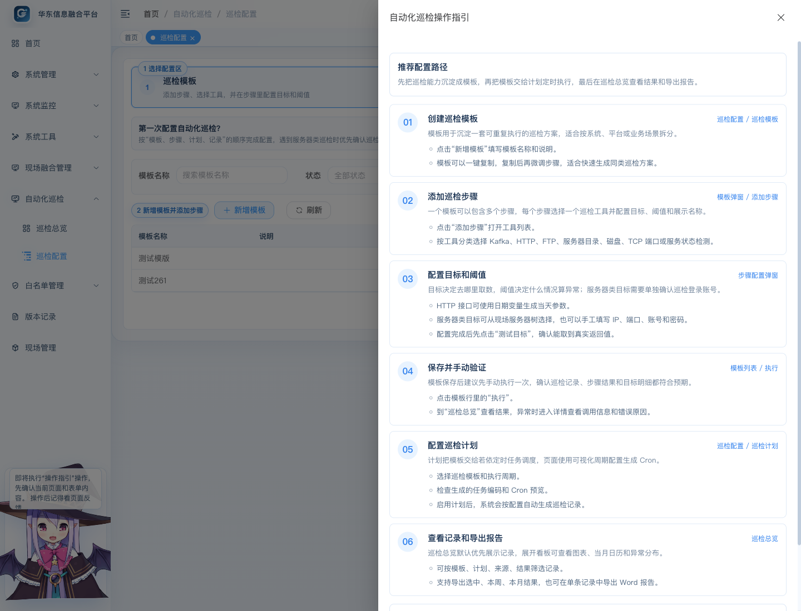

操作指引打开后，会用抽屉说明从“创建模板、添加步骤、配置目标、手动验证、配置计划、查看记录”的完整路径，并在当前页面上用小标签标注关键操作位置。指引内已经整合本手册的关键说明和截图，底部也提供完整 Markdown 文档入口。

## 5. 创建巡检模板

在 `巡检配置` -> `巡检模板` 中点击“新增模板”。

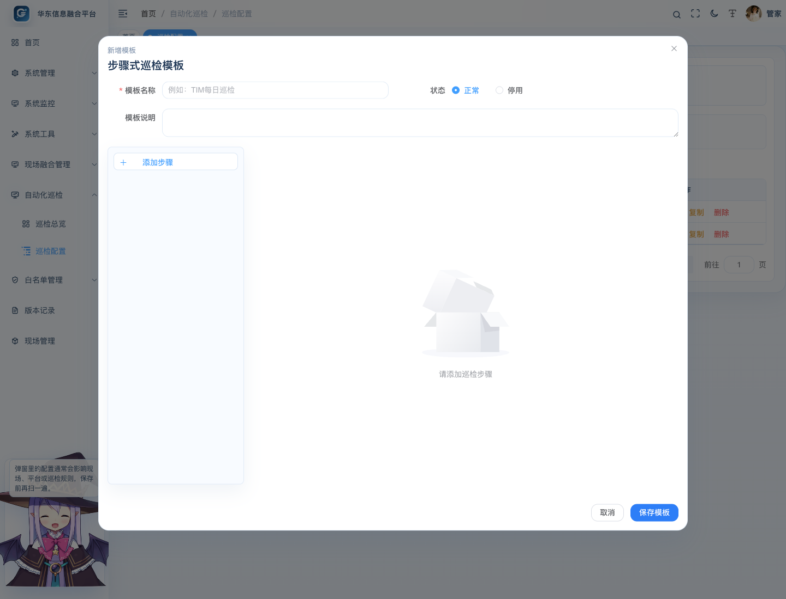

建议填写：

| 字段 | 说明 |
| --- | --- |
| 模板名称 | 建议按系统或业务场景命名，例如“TIM 平台每日巡检”。 |
| 模板说明 | 简要说明巡检范围、适用系统和执行时机。 |
| 状态 | 正常表示可执行；停用后不建议绑定新计划。 |

模板列表支持编辑、执行、复制和删除。复制模板会生成一份相同配置的新模板，名称会追加“（复制）”，适合快速创建同类系统的巡检方案。

## 6. 选择巡检工具

在模板弹窗中点击“添加步骤”，系统会先打开工具选择弹窗。

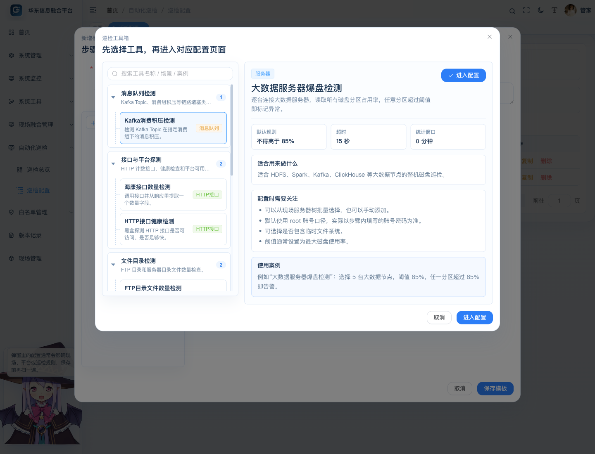

工具按场景树状分类展示，右侧会展示工具用途、默认规则、配置项和使用案例。推荐先看右侧说明，再点击“进入配置”。

当前内置工具如下：

| 工具 | 典型用途 |
| --- | --- |
| Kafka 消费积压检测 | 检查 topic 和 consumer group 的 lag 是否超阈值。 |
| 海康接口数量检测 | 调用海康平台接口统计过车数量、违法数量等。 |
| HTTP 接口健康检测 | 检查普通 HTTP 接口是否可访问、返回是否符合预期。 |
| FTP 目录文件数量检测 | 统计一个或多个 FTP 目录下的文件数量。 |
| 服务器目录文件数量检测 | 登录指定服务器，统计目录文件数量。 |
| 服务器磁盘使用率检测 | 登录指定服务器，检查磁盘分区使用率。 |
| 大数据服务器爆盘检测 | 检查一个或多个大数据服务器所有分区占用情况。 |
| TCP 端口连通性检测 | 检查主机端口是否可连通。 |
| 服务器服务状态检测 | 执行 `systemctl status 服务名`，可按配置自动重启异常服务。 |

## 7. 配置巡检步骤

选择工具后进入具体步骤配置页。

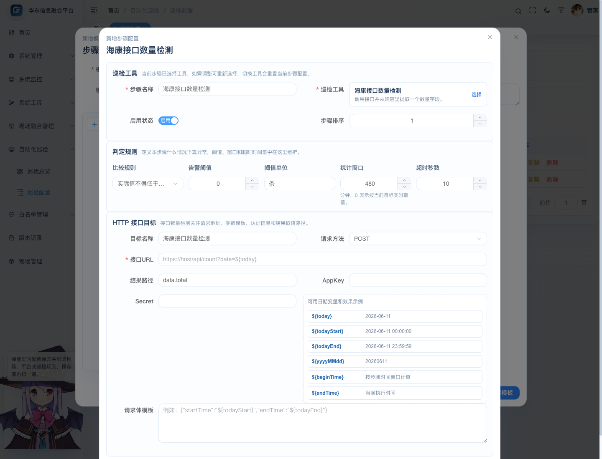

通用字段说明：

| 字段 | 说明 |
| --- | --- |
| 步骤名称 | 展示在巡检记录和报告里，建议写清业务含义。 |
| 巡检工具 | 当前步骤使用的检测能力。 |
| 目标名称 | 当前检查对象的业务名称，例如“过车接口”“主 Kafka”。 |
| 阈值和比较规则 | 定义正常和异常的判断条件。 |
| 超时时间 | 单个目标检测允许等待的最长时间。 |
| 备注 | 记录接口来源、联系人或配置说明。 |

### 7.1 HTTP / 海康接口类

HTTP 类工具主要配置 URL、请求方法、请求头、请求体、返回结果路径和阈值。接口参数中可以使用日期变量，例如当天日期、开始时间、结束时间等，用于每天自动生成请求参数。

建议操作：

1. 先在步骤里填好接口地址、方法和参数。
2. 在“结果路径”中填写返回体里的计数字段，例如 `data.total`。
3. 点击“测试目标”，确认系统可以拿到实际值。
4. 再保存步骤，避免把不可用接口加入模板。

### 7.2 Kafka 类

Kafka 工具用于检查指定 topic 和 consumer group 的消费积压。需要填写 bootstrap server、topic、consumer group 和 lag 阈值。

建议把“原始 Kafka 积压”和“二次分析 Kafka 积压”配置成同一个模板里的两个步骤，而不是写成两个固定功能。

### 7.3 FTP 目录文件数量

FTP 工具支持一个步骤配置多个 FTP 目录目标。每个目标需要配置目标名称、主机、端口、目录、账号、密码和文件数量阈值。可使用复制功能快速复制一个已填写好的目标，再修改目录或名称。

### 7.4 服务器目录、磁盘和大数据服务器

服务器类工具可以手动添加服务器，也可以从现场融合管理里的服务器资产树中选择。选择现场服务器时，系统只带出服务器名称、IP、SSH 端口和账号提示；实际执行时只使用巡检配置中保存的巡检登录账号和密码。

默认账号规则：

| 工具 | 默认账号 | 默认端口 |
| --- | --- | --- |
| 服务器目录文件数量检测 | `hik` | 优先使用服务器 SSH 端口，空值时用 `55555` |
| 服务器磁盘使用率检测 | `hik` | 优先使用服务器 SSH 端口，空值时用 `55555` |
| 大数据服务器爆盘检测 | `root` | 优先使用服务器 SSH 端口，空值时用 `2343` |

如果现场不允许 root 直接登录，应在步骤中填写实际可登录账号，并按需要配置 sudo 或 su 提权方式。

### 7.5 TCP 端口连通性

TCP 端口工具只检查主机和端口是否可连通，适合验证 Kafka、数据库、接口网关、FTP 端口等基础连通性。

### 7.6 服务器服务状态检测

服务状态工具会登录服务器执行 `systemctl status 服务名`，并解析服务状态。正常结果通常为 `active (running)`，异常结果可能为 `inactive (dead)`、`failed` 等。

可选配置：

| 配置 | 说明 |
| --- | --- |
| 提权方式 | 可选择不提权、sudo 或 su。 |
| 异常自动拉起 | 开启后异常时执行 `systemctl restart 服务名`。 |
| 复查等待秒数 | 重启后等待一段时间，再次检查服务状态。 |

## 8. 配置巡检计划

进入 `巡检配置` -> `巡检计划`，点击“新增计划”。

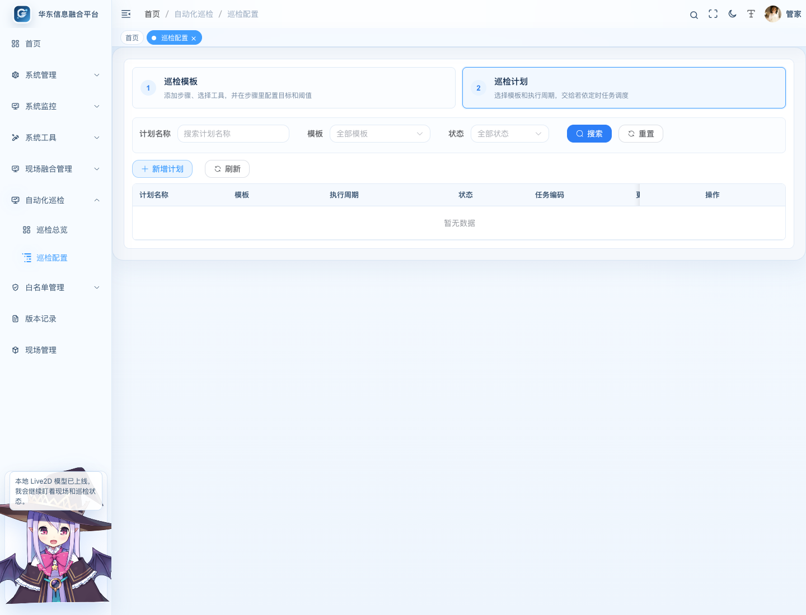

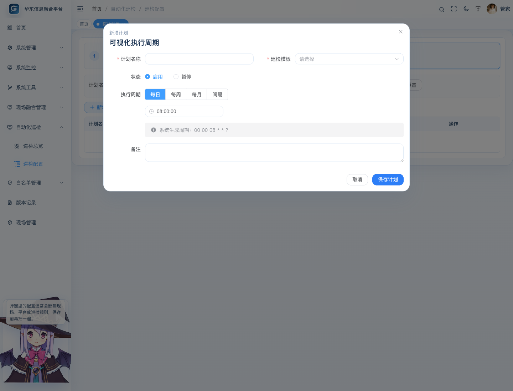

计划字段说明：

| 字段 | 说明 |
| --- | --- |
| 计划名称 | 建议按系统和周期命名，例如“TIM 每日 9 点巡检”。 |
| 巡检模板 | 选择已经配置好的模板。 |
| 任务编码 | 对应若依定时任务编码，用于排查定时调度。 |
| 执行周期 | 页面可视化配置每日、每周、每月或间隔执行。 |
| Cron 预览 | 系统自动生成，只读展示，不要求用户手写 Cron。 |
| 状态 | 启用后按计划执行；暂停后不会继续触发。 |

保存计划后，系统会通过若依自带定时任务执行，不需要单独部署调度服务。

## 9. 查看巡检总览和记录

进入 `自动化巡检` -> `巡检总览`。

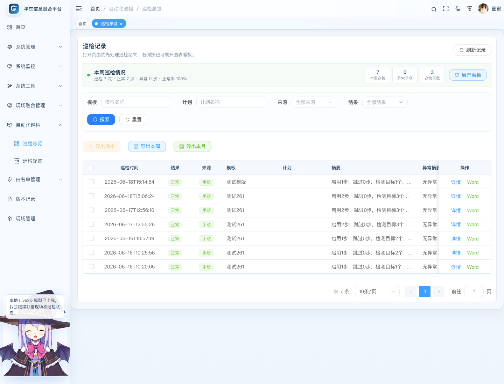

页面默认优先展示巡检记录。可以按模板、计划、来源、结果筛选，也可以刷新记录。

常用操作：

| 操作 | 说明 |
| --- | --- |
| 详情 | 查看单次巡检的步骤结果和目标明细。 |
| Word | 导出单次巡检 Word 报告。 |
| 导出选中 | 多选记录后导出 Excel 汇总。 |
| 导出本周 | 导出本周巡检结果 Excel。 |
| 导出本月 | 导出本月巡检结果 Excel。 |

点击“展开看板”可以查看图表化统计。

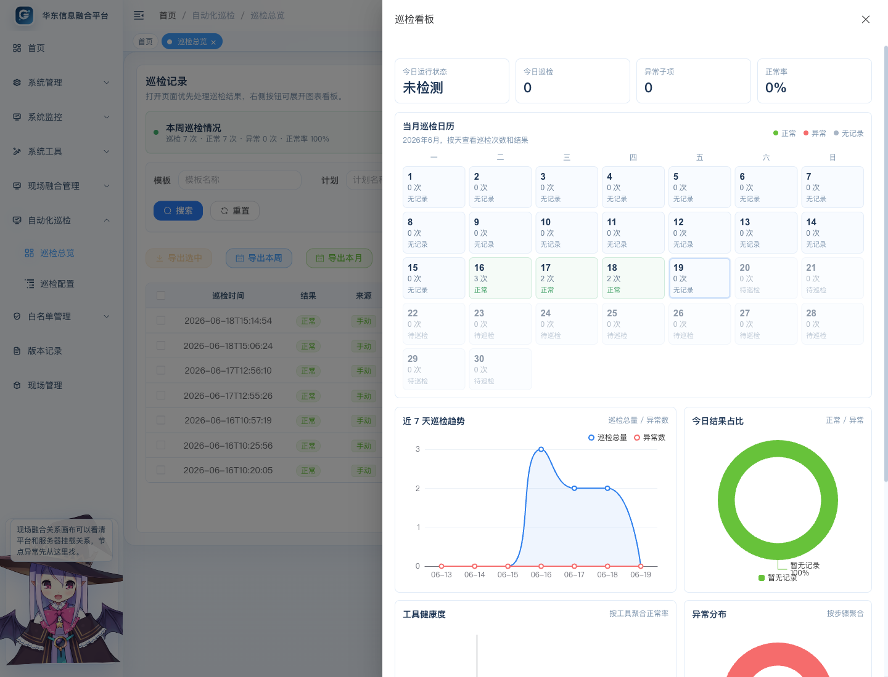

看板包含本周趋势、结果分布、工具健康度、异常目标排行和当月巡检日历。异常日期会突出显示，方便快速定位问题发生时间。

## 10. 查看巡检详情

在巡检记录行点击“详情”。

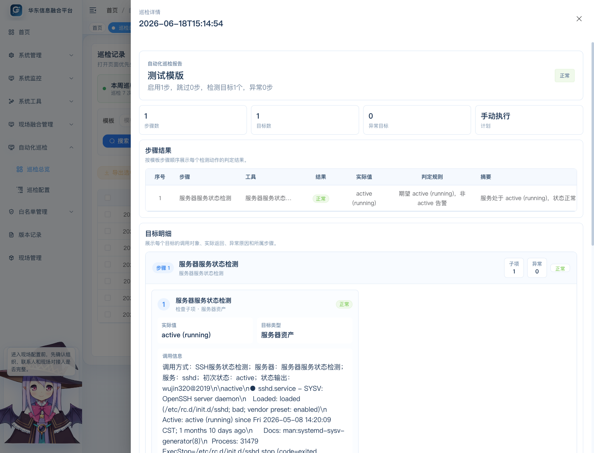

详情页包含三部分：

| 区域 | 说明 |
| --- | --- |
| 基础信息 | 展示巡检时间、模板、计划、整体结果、摘要。 |
| 步骤结果 | 按步骤展示工具、结果、实际值、阈值和摘要。 |
| 目标明细 | 按“步骤 / 子项”分组展示每个目标的调用信息、实际值、错误原因。 |

目标明细中的调用信息用于排错，可能包含接口返回、命令输出或服务状态文本。内容较长时优先查看异常原因和实际值，再按需展开完整明细。

## 11. 推荐配置流程

第一次使用时建议按以下顺序：

1. 进入 `巡检配置`，点击“操作指引”了解流程。
2. 新增一个巡检模板。
3. 添加一个步骤，选择巡检工具。
4. 配置目标、账号、阈值并点击“测试目标”。
5. 保存模板后手动执行一次。
6. 在 `巡检总览` 查看记录和详情。
7. 确认结果正确后，再配置巡检计划。
8. 第二天或下一次定时执行后，检查计划是否正常生成记录。

## 12. 常见问题

### 12.1 测试目标成功，但计划执行失败

优先检查计划绑定的模板是否保存了最新步骤。服务器类工具还要确认巡检配置里保存的 SSH 账号和密码正确，系统不会回退使用现场服务器资产里登记的密码。

### 12.2 服务器密码显示为星号

星号只是前端脱敏展示。如果需要查看明文，需要用户具备 `support:credential:viewPlain` 权限，并点击密码框右侧的小眼睛。

### 12.3 HTTP 接口返回了数据但提示无法解析计数字段

检查“结果路径”是否与接口返回结构一致。例如返回为：

```json
{
  "data": {
    "total": 12
  }
}
```

结果路径应填写 `data.total`。

### 12.4 服务器服务状态检测显示异常

检查服务名是否正确，例如 `firewalld`、`nginx`、`mysql`。如果服务器需要提权执行 `systemctl`，应配置 sudo 或 su，并填写对应提权密码。

### 12.5 导出没有数据

导出选中需要先勾选记录；导出本周和导出本月按巡检时间过滤，如果当前周期没有记录，Excel 里只会有表头或空汇总。

## 13. 部署携带文件

部署时建议同步带上以下文件：

| 文件 | 用途 |
| --- | --- |
| `WDF100.0/doc/自动化巡检功能操作手册.md` | 自动化巡检操作手册正文。 |
| `WDF100.0/doc/auto-inspection-manual-assets/` | 手册截图素材目录。 |

本次手册和前端操作指引不涉及数据库结构变化，不需要新增 SQL 升级脚本。
