# 自动化巡检功能操作手册

## 模块简介

自动化巡检是平台面向日常运维巡查、系统健康检查和周期性报告归档建设的统一巡检能力。它把过去分散在人工登录、脚本执行、共享文档记录和临时截图里的检查动作，沉淀为“巡检工具、巡检步骤、巡检模板、巡检计划、巡检记录、巡检报告”这一套闭环流程。用户可以在页面中选择 Kafka、HTTP 接口调用测试、HTTP 健康、FTP 目录、服务器目录、磁盘、端口、服务状态、大数据服务器爆盘等巡检工具，按业务系统自由组合成模板，再通过手动执行或若依定时任务自动执行，最终形成可查询、可追溯、可导出的巡检结果。

该模块重点服务于现场运维人员、平台管理员和项目交付人员：现场运维人员可以快速确认系统是否正常运行；平台管理员可以统一维护巡检模板、计划和执行账号；项目交付人员可以将巡检结果整理为周报、月度周报和验收支撑材料。自动化巡检同时和“现场融合管理”联动，能够复用现场服务器资产的名称、IP、SSH 端口和归属关系，但巡检执行使用的 SSH 账号密码始终以巡检配置中填写的内容为准，避免资产登记账号和巡检执行账号混用。

从业务价值上看，自动化巡检解决的是“检查动作标准化、执行过程自动化、异常定位结构化、报告归档规范化”的问题。它不是简单的记录表，也不是固定写死的巡检清单，而是一个可以随着项目变化持续扩展的巡检工作台。后续只要新增巡检工具或调整目标配置，就可以复用现有模板、计划、看板和报告能力，降低现场巡检的人力成本和交接成本。

适用版本：`v3.7.5`

适用模块：自动化巡检 / 巡检配置 / 巡检总览 / 巡检版本记录

编写时间：2026-06-25

部署形态：离线部署可用，截图和 HTML 文档均为本地静态资源

## 1. 功能定位

自动化巡检用于把日常运维检查动作沉淀为可复用、可编排、可定时执行、可追溯归档的巡检流程。它不是一个固定的“七项巡检”页面，而是把 Kafka、HTTP 接口调用、HTTP 健康、FTP、服务器目录、磁盘、端口和服务状态等能力抽象为巡检工具，再由用户自由组合成巡检模板，最终通过手动执行或计划任务生成巡检记录、看板和周报。

它主要解决以下业务问题：

| 痛点 | 平台解决方式 |
| --- | --- |
| 巡检脚本分散，执行结果靠人工截图或共享文档记录 | 巡检统一在平台配置，执行结果自动形成记录和详情 |
| 检查目标、账号、阈值写死，调整要改代码 | 目标、阈值、账号、计划都在页面配置，保存后下次执行生效 |
| 多个系统巡检逻辑相似但无法复用 | 通过“模板复制”和“步骤复制”快速创建同类巡检方案 |
| 异常结果难定位 | 详情页按“步骤 / 子项”展示调用信息、实际值和异常原因 |
| 管理层需要周期性报告 | 支持按周导出 Word 周报，按月导出每周独立 Word 的压缩包 |
| 现场服务器账号和巡检执行账号容易混用 | 从现场融合管理只带出服务器资产信息，巡检执行只使用巡检配置里的账号密码 |

核心业务关系如下：

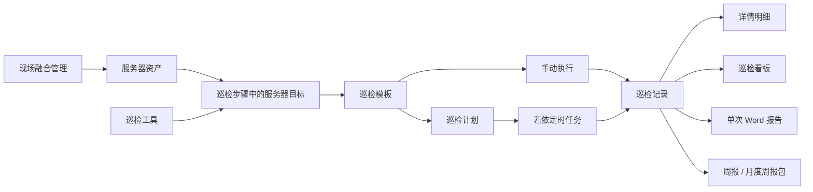

## 2. 页面入口与权限

登录系统后，在左侧菜单进入：

- `自动化巡检` -> `巡检总览`
- `自动化巡检` -> `巡检配置`
- `自动化巡检` -> `巡检版本记录`

`巡检总览` 用于查看记录、展开图表看板、查看详情和导出报告。`巡检配置` 用于维护巡检模板和巡检计划。`巡检版本记录` 用于查看自动化巡检模块的独立版本号、关联平台总版本号、修改重点和涉及 SQL。

常用权限如下：

| 操作 | 权限字符 |
| --- | --- |
| 查看巡检记录和配置 | `support:autoInspection:query` |
| 维护巡检模板 | `support:autoInspection:template` |
| 维护巡检计划 | `support:autoInspection:plan` |
| 手动执行巡检 | `support:autoInspection:run` |
| 导出巡检报告 | `support:autoInspection:export` |
| 查看巡检密码明文 | `support:credential:viewPlain` |

拥有 `datafusion` 权限字符的用户，会按现场融合体系具备自动化巡检相关权限。若按钮不可见，优先检查用户角色是否绑定了对应菜单权限。

## 3. 巡检总览

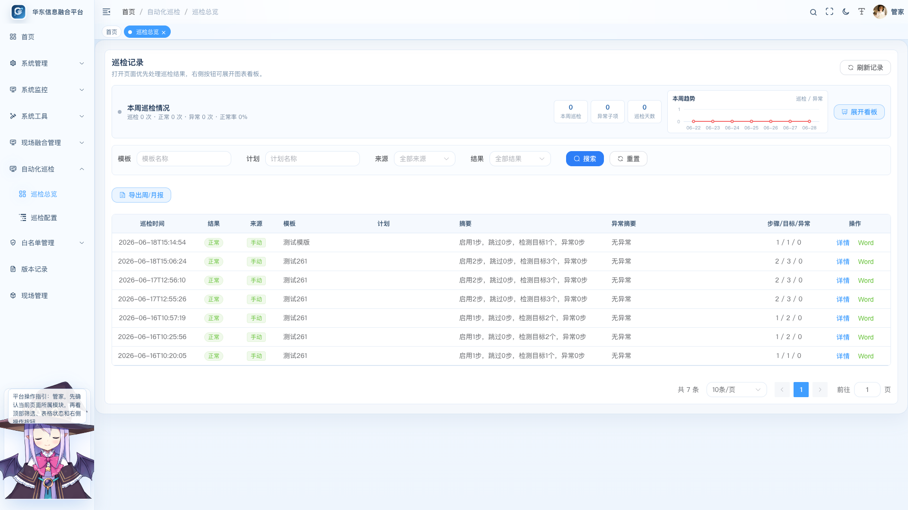

巡检总览打开后优先展示巡检记录，方便用户第一时间处理最新结果。顶部保留轻量的本周巡检情况和趋势图，避免看板占用过多首屏空间。

页面主要区域如下：

| 区域 | 说明 |
| --- | --- |
| 本周巡检情况 | 展示本周巡检次数、异常子项、巡检天数和本周趋势 |
| 筛选区 | 按模板、计划、来源、结果筛选记录 |
| 导出周/月报 | 生成周期性 Word 巡检报告 |
| 巡检记录表 | 展示巡检时间、结果、来源、模板、计划、摘要、异常摘要和操作 |
| 展开看板 | 打开完整图表看板和当月日历 |

建议日常使用顺序：

1. 进入巡检总览先看最新记录结果。
2. 如果出现异常，点击“详情”查看步骤和子项。
3. 需要周期归档时点击“导出周/月报”。
4. 需要看整体趋势时点击“展开看板”。

## 4. 巡检看板

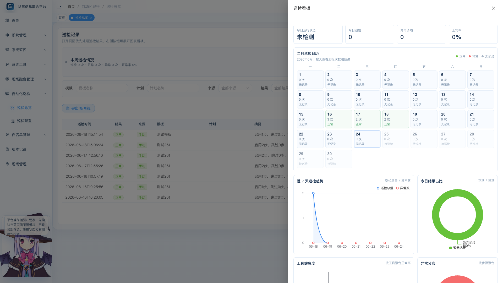

巡检看板默认收起，点击“展开看板”后以抽屉形式展示。看板以图表为主，减少大段文字。

看板包含：

| 内容 | 业务价值 |
| --- | --- |
| 本周巡检趋势 | 查看每天巡检次数和异常次数变化 |
| 结果分布 | 快速判断正常、异常、跳过的比例 |
| 工具健康度 | 按巡检工具聚合正常率，定位是哪类检测经常异常 |
| 异常目标 | 展示最近异常目标，方便优先处理 |
| 当月巡检日历 | 按天展示巡检次数和异常结果，便于月度回顾 |

## 5. 周报和月度周报导出

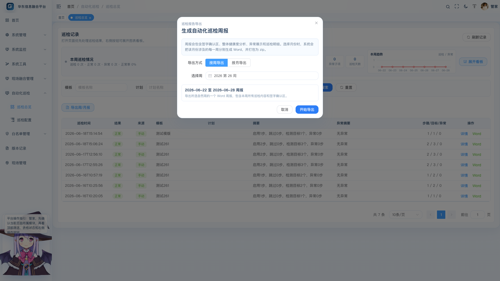

点击“导出周/月报”后，可以选择按周或按月导出。

按周导出时，系统生成一个 Word 周报，文件名类似：

```text
自动化巡检周报_20260622-20260628.doc
```

周报内容包含：

| 章节 | 内容 |
| --- | --- |
| 签字确认 | 文档开头包含巡检人员签字、用户签字、确认日期和备注 |
| 整体健康度分析 | 统计巡检次数、正常/异常/未检测数量、记录健康度、目标子项健康度 |
| 异常展示 | 汇总本周异常目标、调用信息、实际值和异常原因 |
| 本周巡检内容汇总 | 展示本周所有巡检记录 |
| 巡检明细 | 按记录、步骤和目标展开完整结果 |

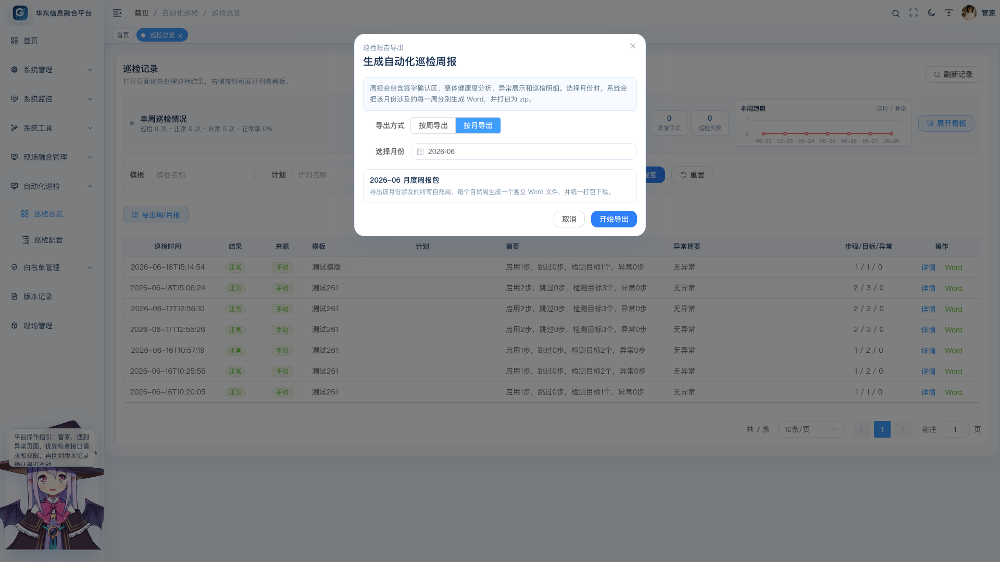

按月导出时，系统会把该月份涉及的自然周逐周生成 Word 文件，再打包为 zip。每个周报都是独立文件，方便按周归档和签字确认。即使某周没有巡检记录，也会生成一份“暂无巡检记录”的留档文档。

## 6. 查看巡检详情

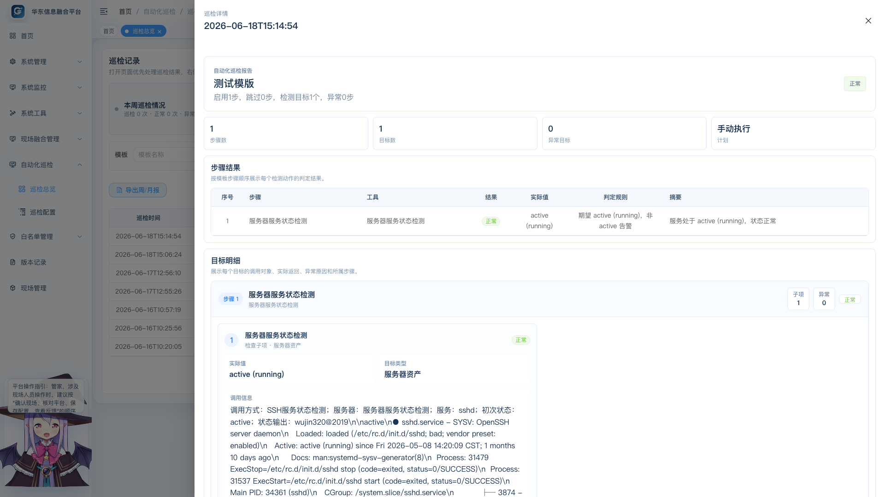

巡检记录行点击“详情”后，会打开右侧详情抽屉。详情页重点突出“步骤 / 子项”的层级关系。

详情页包含：

| 区域 | 说明 |
| --- | --- |
| 报告概览 | 展示模板名称、整体结果、摘要和计划来源 |
| 指标卡片 | 展示步骤数、目标数、异常目标和执行计划 |
| 步骤结果 | 按模板步骤顺序展示工具、结果、实际值、判定规则和摘要 |
| 目标明细 | 按步骤分组展示每个子项的目标、实际值、调用信息和异常原因 |

排障时建议先看“目标明细”：

1. 先找到异常步骤。
2. 再看该步骤下具体异常子项。
3. 查看“实际值”和“调用信息”确认接口返回、命令输出或服务状态。
4. 查看“异常原因”判断是连通性、鉴权、阈值、路径还是服务状态问题。

## 7. 巡检配置总览

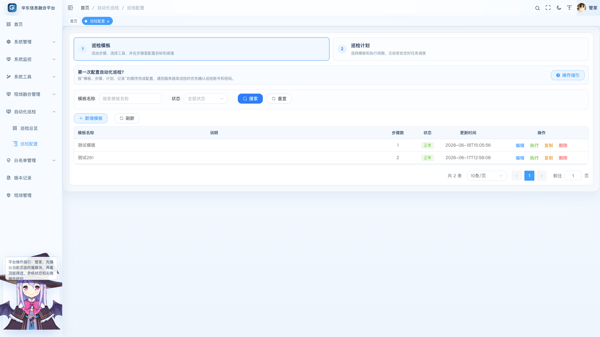

巡检配置页面把模板和计划收敛到一个入口内，避免用户在多个菜单之间来回切换。

配置页主要包含：

| 区域 | 用途 |
| --- | --- |
| 巡检模板 | 维护一套可重复执行的巡检步骤 |
| 巡检计划 | 把模板交给若依定时任务按周期执行 |
| 操作指引 | 新用户可按步骤查看完整配置流程和截图说明 |

第一次配置建议顺序：

1. 创建巡检模板。
2. 添加巡检步骤并选择工具。
3. 配置目标、账号、阈值并测试目标。
4. 保存模板。
5. 手动执行模板验证结果。
6. 配置巡检计划。
7. 后续在巡检总览查看记录和导出报告。

## 8. 系统内操作指引

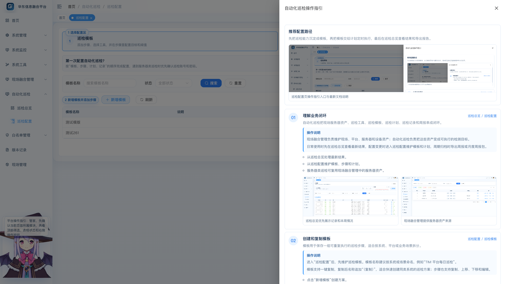

“操作指引”入口位于巡检配置页面右侧。点击后会打开抽屉，按步骤展示模板、工具、目标、计划、记录和报告导出的操作路径，并提供完整离线文档入口。

指引适合以下场景：

| 场景 | 使用方式 |
| --- | --- |
| 新用户第一次配置 | 按抽屉步骤从模板开始逐项完成 |
| 忘记工具含义 | 对照工具选择说明和截图 |
| 部署交付培训 | 直接打开完整文档进行讲解 |
| 离线环境使用 | 文档和截图均随前端静态资源打包，无需外网 |

## 9. 创建和维护巡检模板

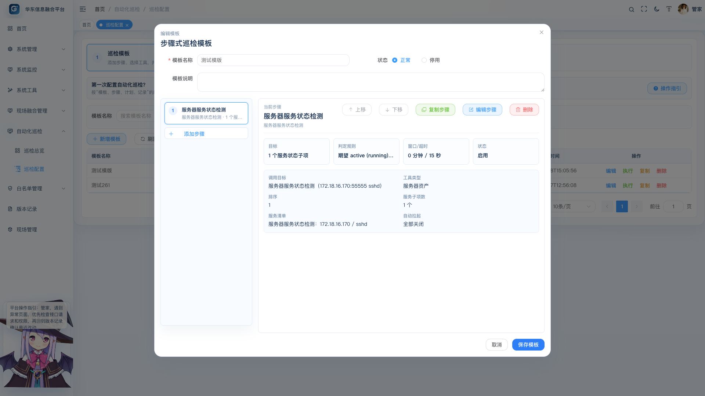

巡检模板是自动化巡检的核心。一个模板可以包含多个巡检步骤，每个步骤代表一个具体检测动作。

模板字段说明：

| 字段 | 说明 |
| --- | --- |
| 模板名称 | 建议按系统、平台或业务命名，例如“TIM 平台每日巡检” |
| 模板说明 | 说明巡检范围、适用系统和执行时机 |
| 状态 | 正常表示可执行，停用后不建议绑定新计划 |
| 步骤列表 | 当前模板包含的巡检步骤 |

模板支持的操作：

| 操作 | 说明 |
| --- | --- |
| 新增模板 | 从零创建一套巡检方案 |
| 编辑模板 | 修改名称、说明、步骤和状态 |
| 执行 | 对模板做一次手动巡检 |
| 一键复制 | 复制出相同模板，名称后追加“（复制）” |
| 删除 | 删除不再使用的模板 |

步骤支持的操作：

| 操作 | 说明 |
| --- | --- |
| 添加步骤 | 先选择巡检工具，再进入对应配置页 |
| 上移 / 下移 | 调整步骤执行和展示顺序 |
| 复制步骤 | 复制一个相同步骤后再微调 |
| 编辑步骤 | 修改工具、目标、账号、阈值 |
| 删除步骤 | 删除不需要的检测动作 |

## 10. 选择巡检工具

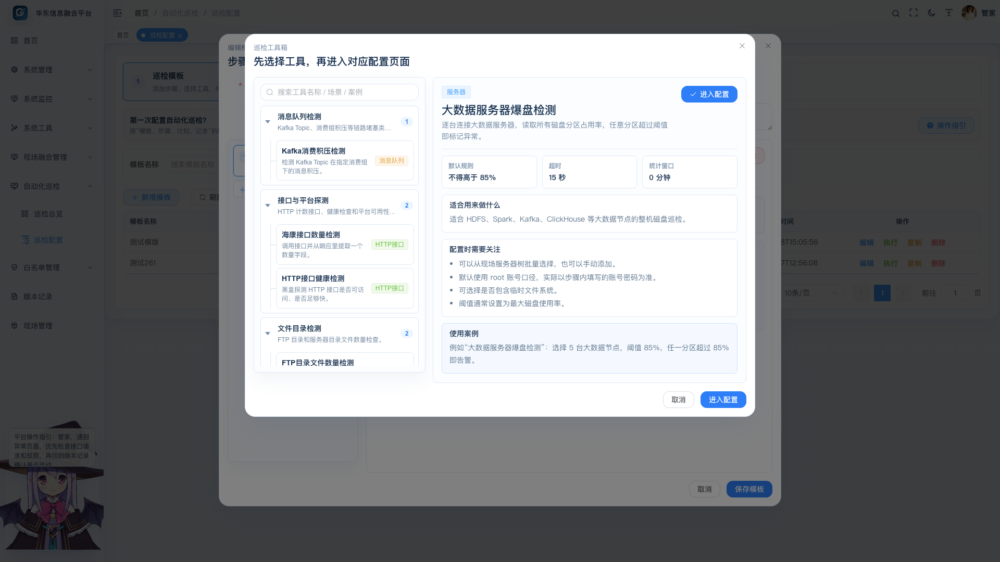

点击“添加步骤”后，系统会先打开巡检工具箱。工具按树状分类展示，右侧提供工具简介、适用场景、配置重点和使用案例。用户先选工具，再进入具体配置页面。

当前内置工具如下：

| 分类 | 工具 | 典型用途 |
| --- | --- | --- |
| 消息队列检测 | Kafka 消费积压检测 | 检查 topic 和 consumer group 的 lag |
| 接口与平台探测 | 海康接口数量检测 | 统计过车、违法、任务等接口返回数量 |
| 接口与平台探测 | HTTP 接口健康检测 | 检查接口是否可访问、响应是否超时 |
| 接口与平台探测 | 接口调用测试 | 模拟 GET/POST 请求，并按状态码、JSON 字段、文本、Header、耗时等多条件判断 |
| 文件目录检测 | FTP 目录文件数量检测 | 统计一个或多个 FTP 目录文件数 |
| 文件目录检测 | 服务器目录文件数量检测 | SSH 登录服务器统计目录文件数 |
| 服务器检测 | 服务器磁盘使用率检测 | 检查指定路径或挂载点磁盘使用率 |
| 服务器检测 | 大数据服务器爆盘检测 | 检查多台大数据服务器所有分区 |
| 服务器检测 | 服务器服务状态检测 | 检查 systemd 服务状态，可异常后自动重启 |
| 网络端口检测 | TCP 端口连通性检测 | 检查主机端口是否可连通 |

选择工具时建议遵循：

1. 能通过接口拿到业务数量时，优先使用海康接口数量检测；需要完整模拟业务接口调用和多条件判断时，使用接口调用测试。
2. 需要看链路积压时，使用 Kafka 消费积压检测。
3. 检查目录积压时，区分 FTP 目录和服务器本地目录。
4. 检查服务器可用性时，区分磁盘、端口和服务状态。
5. 多台同类服务器尽量放在同一个步骤下配置多个子项，便于详情页按步骤聚合展示。

## 11. 配置 HTTP / 海康接口步骤

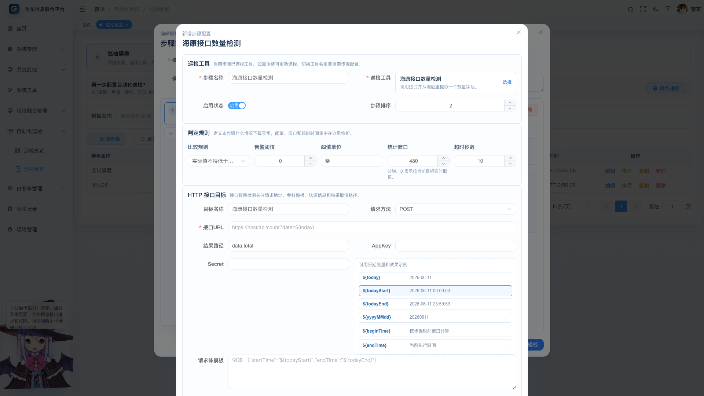

HTTP 类步骤适合做接口计数、平台健康检查和通用接口调用测试。

关键字段：

| 字段 | 说明 |
| --- | --- |
| 步骤名称 | 展示在记录和报告中的业务名称 |
| 比较规则 | 海康接口数量和 HTTP 健康使用数值阈值；接口调用测试使用多条件全部满足规则 |
| 告警阈值 | 触发异常的边界值 |
| 统计窗口 | 用于生成 `${beginTime}`、`${endTime}` 等变量 |
| 目标名称 | 当前接口目标的业务名称 |
| 请求方法 | GET 或 POST |
| 接口 URL | 支持日期变量 |
| 结果路径 | 海康接口数量检测从 JSON 响应中解析计数值，例如 `data.total` |
| AppKey / Secret | 对接海康 Artemis 接口时使用 |
| 请求体模板 | 可使用日期变量生成动态请求参数 |

接口调用测试配置页按页签填写，判定规则说明已压缩，主要空间留给接口目标和参数配置：

| 配置区 | 说明 |
| --- | --- |
| 请求信息 | 填接口名称、GET/POST、URL 和 HTTPS 证书校验方式，URL 输入区独占整行 |
| 参数与鉴权 | 填 Query、Header、Cookie、鉴权方式和请求体；参数名和值使用宽输入区，敏感值保存为密文 |
| 返回条件 | 配置状态码、耗时、JSON 字段、列表数量、响应原文、原文正则和返回 Header；字段路径、Header 名称、匹配内容和正则表达式分区展示，适合第三方接口返回结构不固定的场景 |

“HTTPS 证书校验”默认选严格；只有自建证书测试报错时，再选兼容自建证书。

支持的日期变量：

| 变量 | 示例 | 说明 |
| --- | --- | --- |
| `${today}` | `2026-06-24` | 当天日期 |
| `${todayStart}` | `2026-06-24 00:00:00` | 当天开始时间 |
| `${todayEnd}` | `2026-06-24 23:59:59` | 当天结束时间 |
| `${yyyyMMdd}` | `20260624` | 紧凑日期 |
| `${beginTime}` | 按统计窗口计算 | 窗口开始时间 |
| `${endTime}` | 当前执行时间 | 窗口结束时间 |

配置建议：

1. 先确认接口是否需要 Artemis 签名。
2. 计数接口必须填写结果路径。
3. 健康检测可配置期望状态码。
4. 接口调用测试至少保留一条返回条件；所有条件满足才算正常，任一条件不满足会在目标明细中展示失败原因。
5. 第三方接口返回结构不稳定时，优先使用“响应原文”或“原文正则”，不要强行按 `data.total` 这类固定 JSON 路径配置。
6. 保存步骤前先点击“测试目标”。
7. 接口返回很大时，系统只保存脱敏后的响应预览，避免记录过长和敏感信息泄露。

## 12. 配置 FTP 目录文件数量检测

FTP 文件数量检测支持一个步骤配置多个 FTP 目录目标。

每个 FTP 目标需要填写：

| 字段 | 说明 |
| --- | --- |
| 目标名称 | 例如“FTP 入库目录” |
| 主机地址 | FTP 服务器 IP 或域名 |
| 端口 | 默认 FTP 端口为 21，可按现场调整 |
| 目录路径 | 需要统计的 FTP 目录 |
| 账号 / 密码 | FTP 登录凭据 |

操作要点：

1. 点击“手动添加”增加一个 FTP 目录目标。
2. 已填写好的目标可以点击“复制”，快速生成同类目录配置。
3. 阈值通常用于控制目录积压数量，例如高于 50 个文件告警。
4. 多个 FTP 目录放在一个步骤内，详情页会以同一个步骤下多个子项展示。

## 13. 配置服务器目录、磁盘和服务状态检测

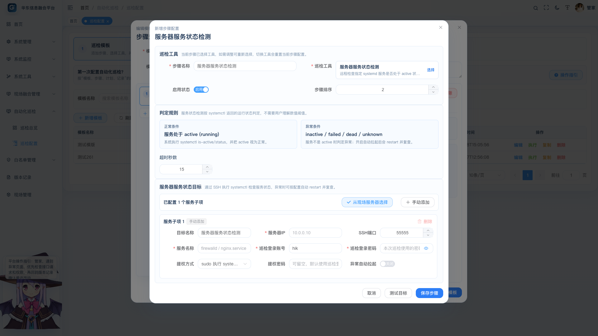

服务器类工具需要通过 SSH 登录目标服务器。当前平台强调“巡检凭据隔离”：

- 从现场融合管理选择服务器时，只带出服务器名称、IP、SSH 端口和账号提示。
- 测试目标、手动执行、计划执行都只使用巡检配置里保存的用户名和密码。
- 不会回退读取现场服务器资产里的密码，避免资产登记账号和巡检执行账号混用。

默认账号和端口口径：

| 工具 | 默认账号 | 默认端口 |
| --- | --- | --- |
| 服务器目录文件数量检测 | `hik` | 优先使用现场服务器 `ssh_port`，为空时用 `55555` |
| 服务器磁盘使用率检测 | `hik` | 优先使用现场服务器 `ssh_port`，为空时用 `55555` |
| 服务器服务状态检测 | `hik` | 优先使用现场服务器 `ssh_port`，为空时用 `55555` |
| 大数据服务器爆盘检测 | `root` | 优先使用现场服务器 `ssh_port`，为空时用 `2343` |

### 13.1 服务器目录文件数量检测

适合检查服务器本地目录是否产生文件或是否积压。

关键配置：

| 字段 | 说明 |
| --- | --- |
| 检测路径 | 需要统计的服务器目录 |
| 递归查询 | 开启后统计当前目录和子目录；关闭后只统计当前目录第一层 |
| 文件匹配 | 例如 `*.dat`，不填则统计全部文件 |
| 多服务器目标 | 支持手动添加和从现场服务器树选择 |

### 13.2 服务器磁盘使用率检测

适合检查某台服务器指定路径或挂载点的使用率。

配置建议：

1. 检测路径优先填写业务数据目录，例如 `/data`。
2. 阈值通常设置为 80% 或 85%。
3. 如果服务器存在多个关键挂载点，可拆成多个步骤或多个目标。

### 13.3 大数据服务器爆盘检测

适合检查 Kafka、HDFS、Spark、ClickHouse 等大数据节点。它会逐台服务器读取分区占用情况，任意分区超过阈值即告警。

配置建议：

1. 多台大数据服务器放在一个步骤里统一管理。
2. 默认账号为 `root`，但最终以步骤内填写的账号密码为准。
3. 若现场不允许 root 登录，需要填写实际可登录账号，并按现场权限配置提权策略。
4. 可根据业务需要决定是否包含临时文件系统。

### 13.4 服务器服务状态检测

服务状态检测会执行类似：

```bash
systemctl status firewalld
```

或通过 `systemctl is-active` 判断服务是否为 `active`。

正常规则展示为：

| 状态 | 含义 |
| --- | --- |
| `active (running)` | 正常 |
| `inactive (dead)` | 异常 |
| `failed` | 异常 |
| `unknown` | 异常 |

可选能力：

| 配置 | 说明 |
| --- | --- |
| 服务名称 | 例如 `firewalld`、`nginx`、`sshd` |
| 提权方式 | 不提权、sudo 或 su |
| 异常自动拉起 | 异常时执行 `systemctl restart 服务名` |
| 复查等待秒数 | 重启后等待一段时间再检查状态 |

## 14. 从现场融合管理选择服务器

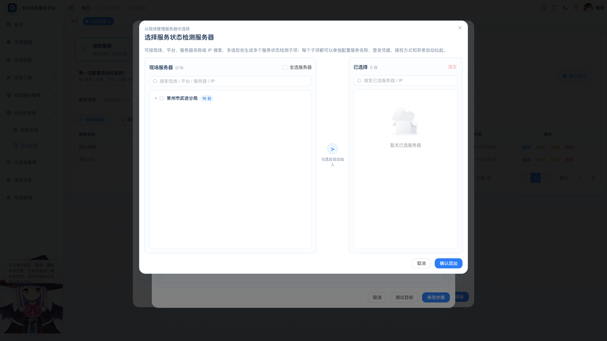

自动化巡检和现场融合管理的关联主要体现在服务器资产复用上。现场融合管理维护现场、平台、子平台和服务器资产；自动化巡检在配置服务器类步骤时，可以直接从这批服务器中选择。

选择弹窗特点：

| 能力 | 说明 |
| --- | --- |
| 树状展示 | 按现场 / 平台 / 服务器层级展示 |
| 默认不展开 | 避免服务器很多时弹窗过长 |
| 数量提示 | 每个现场或平台节点显示下面服务器数量 |
| 搜索 | 可按现场、平台、服务器名称或 IP 搜索 |
| 多选 | 可一次选择多台服务器 |
| 已选列表 | 右侧展示已选服务器和来源路径 |

需要特别注意：

- 现场服务器资产中的账号密码用于资产管理。
- 巡检步骤中的账号密码用于实际执行。
- 从现场服务器选择后，系统可以带出默认账号和密码提示，但测试和计划执行只使用巡检步骤保存的数据。
- 修改现场服务器密码不会自动改变已保存的巡检步骤密码。

## 15. 与现场融合管理的业务关系

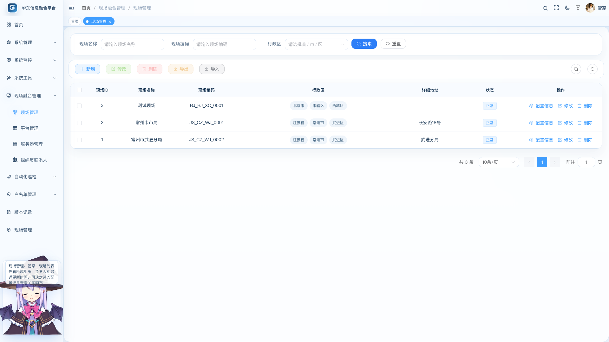

现场融合管理是自动化巡检的重要资产来源。两者关系如下：

| 现场融合管理 | 自动化巡检 |
| --- | --- |
| 维护现场、主平台、子平台、服务器和设备资产 | 从服务器资产树中选择巡检目标 |
| 记录服务器 IP、SSH 端口、hik/root 等登录信息 | 生成巡检目标时可带出 IP、端口和账号提示 |
| 设备资产按现场和网络环境归类 | 巡检模板按系统或业务场景组合目标 |
| 资产变更记录用于追踪现场配置变化 | 巡检记录用于追踪运行状态变化 |

推荐管理方式：

1. 先在现场融合管理中维护清楚现场、平台、服务器资产。
2. 在自动化巡检中从现场服务器树选择目标。
3. 在巡检步骤里单独确认巡检执行账号和密码。
4. 服务器发生迁移或 IP 变更时，先更新现场融合管理，再检查相关巡检模板。

## 16. 配置巡检计划

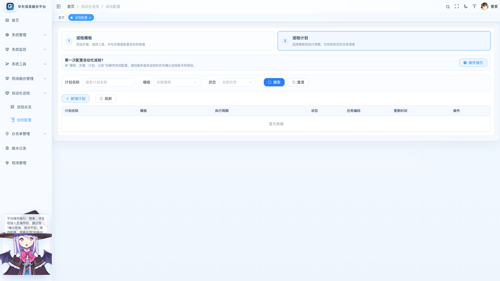

巡检计划用于把已经验证过的模板交给若依定时任务调度。

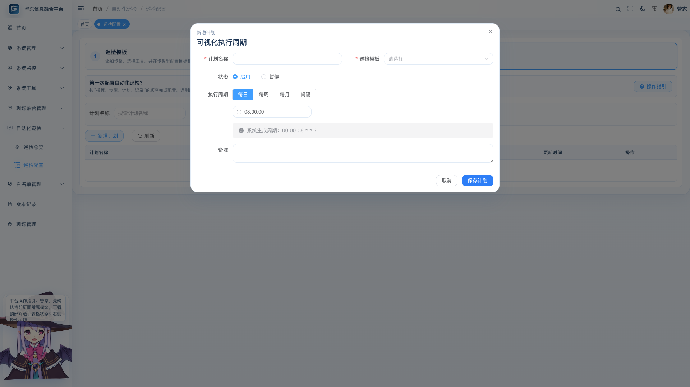

计划字段说明：

| 字段 | 说明 |
| --- | --- |
| 计划名称 | 建议按系统和周期命名，例如“TIM 每日 9 点巡检” |
| 巡检模板 | 选择已经验证过的模板 |
| 任务编码 | 对应若依定时任务编码，用于排查调度 |
| 执行周期 | 页面可视化选择每日、每周、每月或间隔执行 |
| Cron 预览 | 系统自动生成，只读展示 |
| 状态 | 启用后按计划执行，暂停后不再触发 |

计划配置建议：

1. 新模板先手动执行成功，再配置计划。
2. 计划名称和任务编码要能看出系统和周期。
3. 对关键业务建议设置固定每日巡检时间。
4. 对高频链路可使用间隔执行，但要注意目标系统压力。
5. 修改计划后，下一次调度按最新配置执行。

## 17. 单次报告、周报和归档

自动化巡检提供三类报告能力：

| 报告 | 入口 | 适用场景 |
| --- | --- | --- |
| 单次 Word 报告 | 巡检记录行“Word” | 某一次巡检详情留档 |
| 按周 Word 周报 | “导出周/月报”选择按周 | 每周巡检签字确认 |
| 月度周报包 | “导出周/月报”选择按月 | 一次导出某月所有自然周周报 |

周报适合运维交付和用户确认，月度周报包适合月底统一归档。周报中的签字区可以打印后线下签字，也可以作为电子归档附件。

## 18. 推荐落地流程

建议项目交付时按以下流程落地：

1. 在现场融合管理中确认现场、平台、服务器资产已经完整维护。
2. 梳理需要巡检的业务对象，例如 Kafka、海康接口、FTP 目录、服务器目录、磁盘和服务。
3. 按系统创建巡检模板，例如“TIM 每日巡检”“大数据节点巡检”。
4. 每个模板中按业务动作添加步骤。
5. 每个步骤配置目标、账号、阈值并测试目标。
6. 保存模板后手动执行一次。
7. 在巡检总览中查看详情，确认步骤结果和目标明细符合预期。
8. 配置巡检计划。
9. 每周导出周报并由巡检人员和用户签字确认。
10. 每月导出月度周报包归档。

## 19. 常见问题

### 19.1 测试目标成功，但计划执行失败

先确认模板保存的是最新步骤。服务器类工具还要确认巡检配置里保存的 SSH 账号和密码正确，系统不会回退使用现场服务器资产里登记的密码。

### 19.2 从现场服务器选择后，为什么还要填巡检账号密码

现场服务器资产记录的是资产登记信息，自动化巡检执行需要单独的巡检凭据。这样可以避免 root、hik、sudo 等账号混用，也避免资产密码修改影响历史巡检模板。

### 19.3 密码显示为星号

星号是前端脱敏显示。用户需要具备 `support:credential:viewPlain` 权限，点击小眼睛后才会显示明文。

### 19.4 HTTP 接口返回了数据，但提示无法解析计数字段

检查“结果路径”是否和接口返回结构一致。例如返回：

```json
{
  "data": {
    "total": 12
  }
}
```

结果路径应填写：

```text
data.total
```

### 19.5 服务状态检测显示 `inactive (dead)`

说明服务不是运行状态。检查服务名是否正确，确认巡检账号是否有执行 `systemctl` 的权限。如果需要自动拉起，配置 sudo 或 su 提权并开启异常自动重启。

### 19.6 周报导出没有数据

周报按巡检时间统计。如果选中的自然周没有记录，系统仍会生成留档文件，并在文档中提示“本周期暂无巡检记录”。

### 19.7 月度导出的 zip 里为什么有跨月日期

月度导出按自然周生成，只要某个自然周和所选月份有交集，就会生成该周周报。例如某月第一周可能从上个月最后几天开始。

## 20. 部署携带文件

部署时建议同步以下文件：

| 文件 | 用途 |
| --- | --- |
| `WDF100.0/doc/自动化巡检功能操作手册.md` | Markdown 源文档 |
| `WDF100.0/doc/自动化巡检功能操作手册.html` | 离线渲染版文档 |
| `WDF100.0/doc/自动化巡检功能操作手册.docx` | Word 版操作手册，适合邮件转发和交付归档 |
| `WDF100.0/doc/auto-inspection-manual-assets/` | 手册截图素材 |
| `RuoYi-Vue3-master/public/docs/auto-inspection/auto-inspection-manual.md` | 前端静态 Markdown 备份 |
| `RuoYi-Vue3-master/public/docs/auto-inspection/auto-inspection-manual.html` | 系统“打开完整文档”入口 |
| `RuoYi-Vue3-master/public/docs/auto-inspection/auto-inspection-manual.docx` | 前端静态 Word 备份，可随 dist 一起部署 |
| `RuoYi-Vue3-master/public/docs/auto-inspection/auto-inspection-manual-assets/` | 前端静态截图资源，打包进入 `dist/docs/auto-inspection/` |

本次文档更新不涉及数据库结构变化，不需要新增 SQL 升级脚本。
