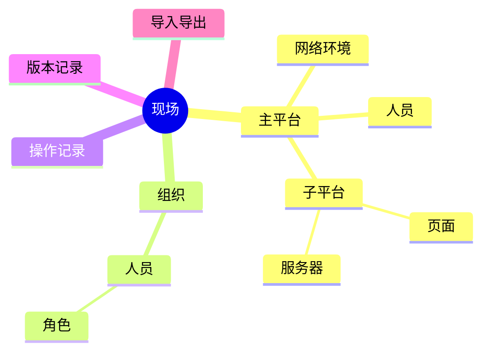
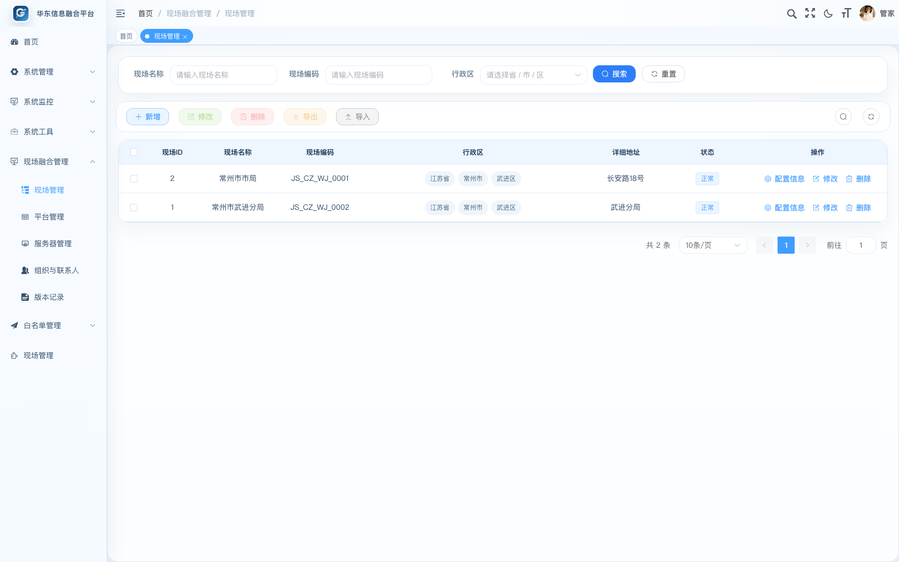
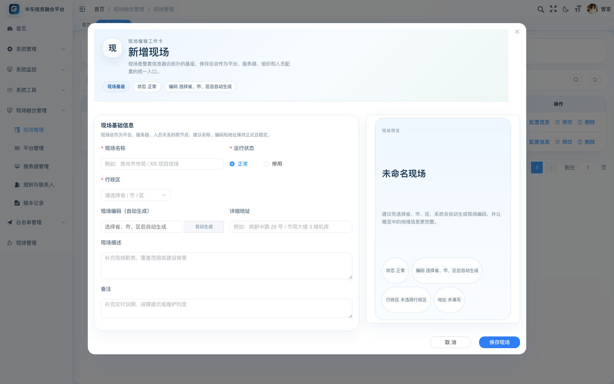
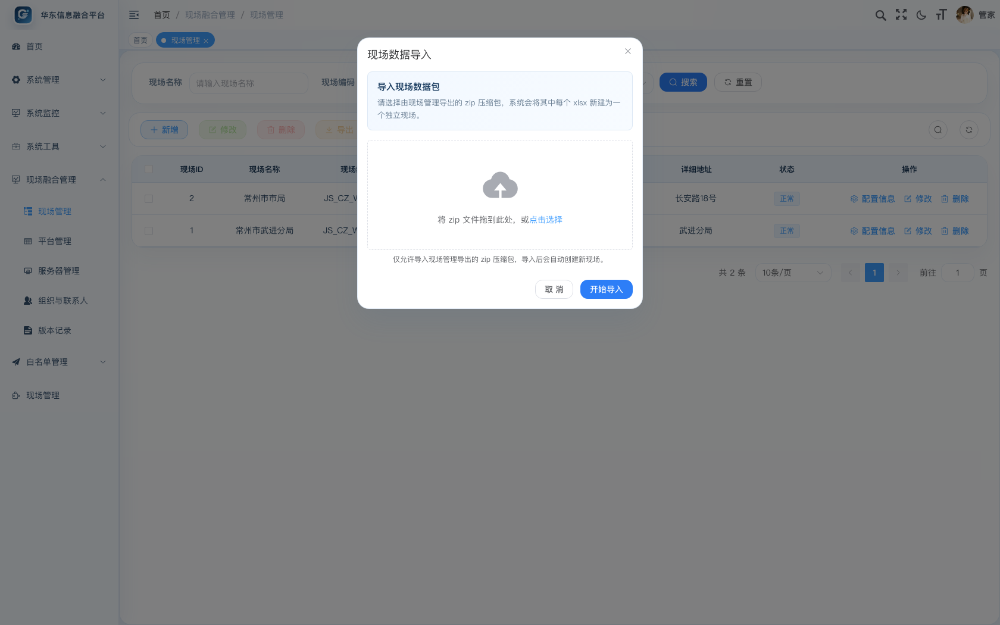
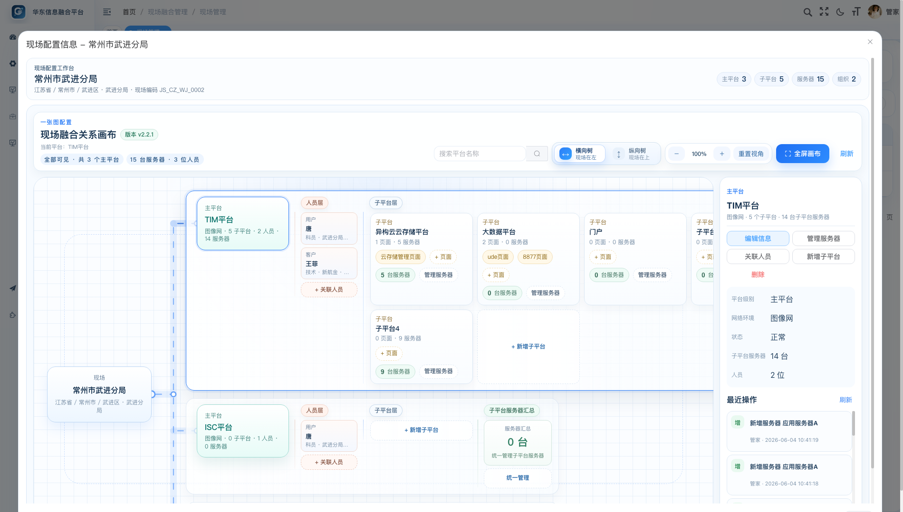
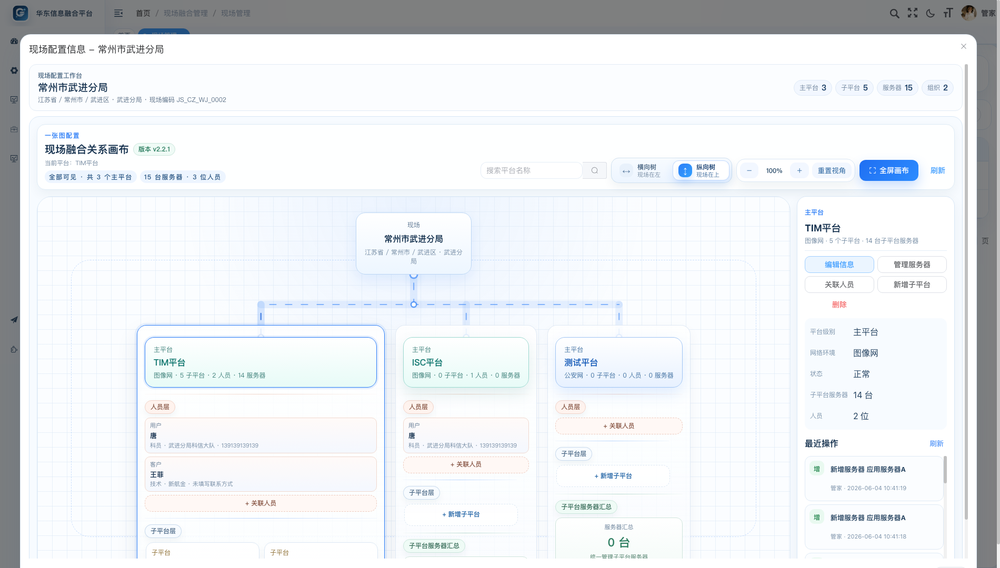
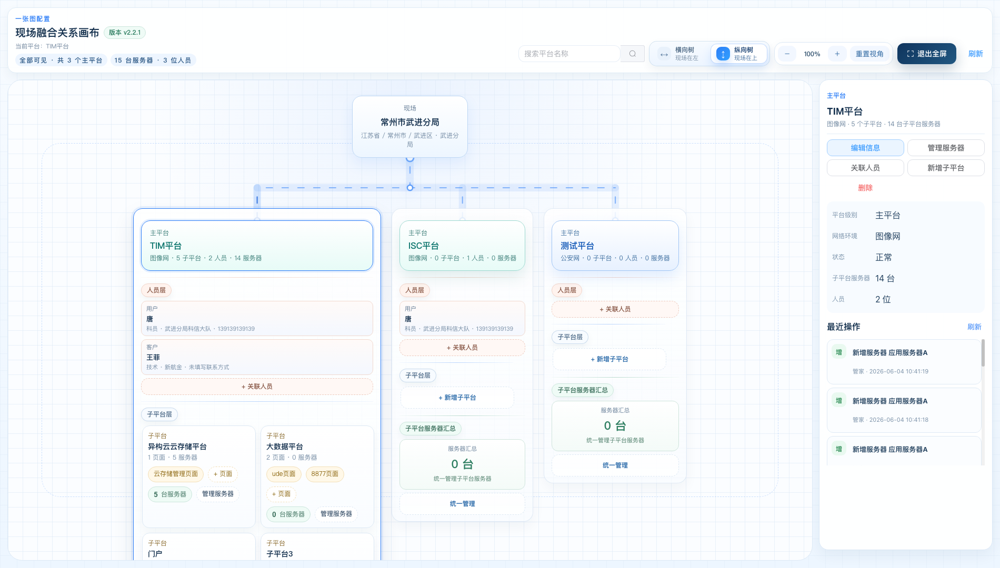
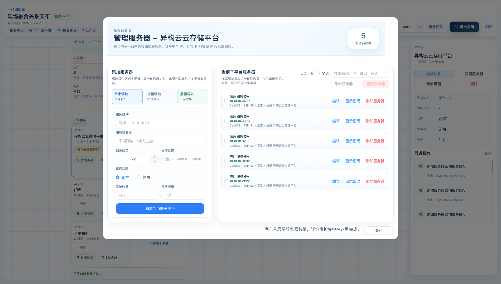
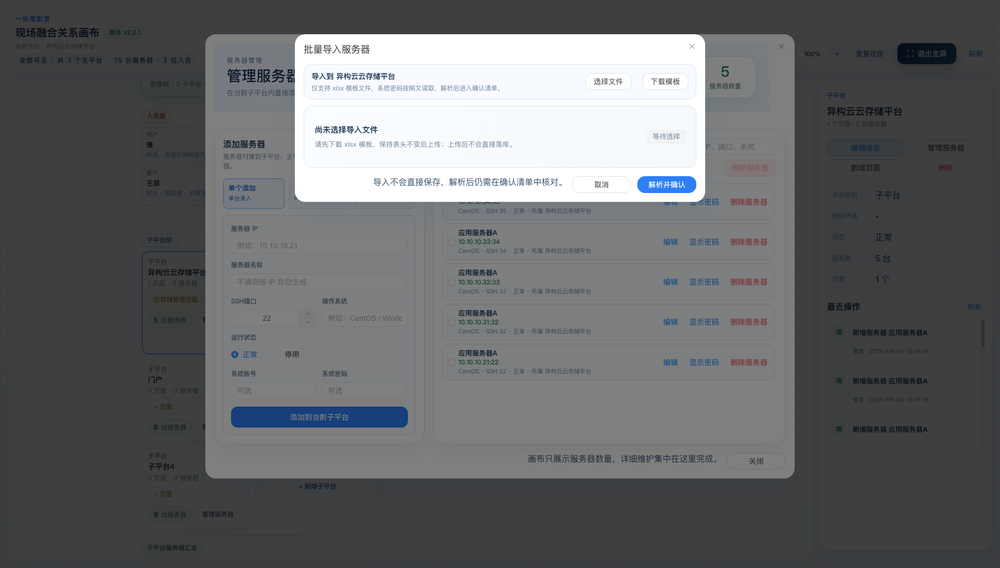
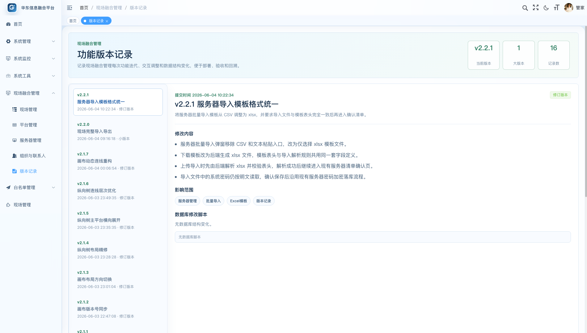

# 现场管理功能操作手册

适用版本：`v2.2.1`  
适用模块：现场融合管理 / 现场管理  
编写时间：2026-06-04

## 1. 功能定位

现场管理用于把一个现场内的主平台、子平台、页面入口、服务器、组织和人员关系集中维护在一张画布里。它解决的问题是：现场资源分散、平台与服务器归属不清、联系人关系难追踪、部署数据无法整体迁移，以及后续版本和数据库变更不易回溯。

核心关系如下：

## 2. 权限说明

拥有 `datafusion` 权限字符的用户，默认具备现场融合管理的全部权限。细分权限包括现场查询、新增、修改、删除、导入、导出，平台维护，服务器维护，组织与联系人维护，以及敏感凭据查看等。

如果按钮不可见或不可点击，优先检查当前用户是否拥有对应权限，例如：

| 操作 | 权限字符 |
| --- | --- |
| 现场列表 | `support:site:list` |
| 新增现场 | `support:site:add` |
| 修改现场 | `support:site:edit` |
| 删除现场 | `support:site:remove` |
| 现场导出 | `support:site:export` |
| 现场导入 | `support:site:import` |
| 服务器新增 | `support:server:add` |
| 查看密码明文 | `support:credential:viewPlain` |

## 3. 进入现场管理

登录系统后，在左侧菜单进入：

`现场融合管理` -> `现场管理`

页面顶部是查询区，可按现场名称、现场编码、行政区筛选。中间工具栏提供新增、修改、删除、导出、导入等操作。下方表格展示现场 ID、现场名称、现场编码、行政区、详细地址、状态和操作入口。

## 4. 现场列表操作

### 4.1 查询现场

1. 在“现场名称”中输入现场关键字。
2. 可选填写“现场编码”。
3. 可选选择“行政区”。
4. 点击“搜索”刷新列表。
5. 点击“重置”清空查询条件。

行政区列中的省、市、区标签也可以用于快速筛选。点击某个行政区标签后，系统会按该行政区快速过滤现场。

### 4.2 新增现场

点击列表工具栏“新增”，打开现场编辑工作卡。

字段说明：

| 字段 | 是否必填 | 说明 |
| --- | --- | --- |
| 现场名称 | 是 | 建议填写正式现场名称，例如“常州市武进分局”。 |
| 运行状态 | 是 | 正常 / 停用。停用后表示该现场暂不作为有效维护对象。 |
| 行政区 | 是 | 选择省、市、区。 |
| 现场编码 | 自动生成 | 根据行政区自动生成，不需要手工录入。 |
| 详细地址 | 否 | 填写现场实际地址或机房位置。 |
| 现场描述 | 否 | 可补充建设背景、覆盖范围、职责说明。 |
| 备注 | 否 | 可记录交付说明、维护约定或排障提示。 |

填写完成后点击“保存现场”。保存成功后，现场会出现在列表中，并可进入“配置信息”继续维护平台和资源关系。

### 4.3 修改现场

在列表中点击某一行的“修改”，进入同样的现场编辑工作卡。修改后点击“保存现场”。

注意：现场编码由行政区和系统规则生成，修改行政区可能导致编码预览发生变化。

### 4.4 删除现场

在列表中勾选现场后点击“删除”，或点击行内“删除”。确认后会删除该现场数据。

建议删除前先确认该现场是否仍有平台、服务器、人员等配置数据，避免误删影响后续维护。

### 4.5 导出现场

1. 在列表中勾选一个或多个现场。
2. 点击“导出”。
3. 系统会下载一个 zip 压缩包。

导出规则：

- 每个现场生成一个独立的 `.xlsx` 文件。
- 多个现场统一打包为一个 `.zip`。
- xlsx 中包含现场信息、主平台、子平台、页面、服务器、组织、人员、主平台人员关系、子平台服务器关系等数据。
- 服务器密码和页面登录密码按明文导出。

### 4.6 导入现场

点击列表工具栏“导入”，打开现场数据导入弹窗。

操作步骤：

1. 选择由现场管理导出的 zip 压缩包。
2. 点击“开始导入”。
3. 系统解析压缩包中的 xlsx 文件。
4. 每个 xlsx 会新建为一个独立现场。
5. 导入完成后，系统会提示新建现场数量和名称。

导入规则：

- 只支持现场管理导出的 zip。
- 导入后现场名称会追加“导入副本 + 时间”。
- 现场编码会重新生成。
- 原始 ID 不会复用，系统会重建平台、人员、服务器、页面和关系。
- 任意文件失败时，本次导入整体回滚。

## 5. 配置信息画布

在现场列表行内点击“配置信息”，进入现场配置工作台。

画布用于集中维护当前现场的拓扑结构。顶部显示当前现场、版本号、统计信息和画布控制按钮；中间是关系画布；右侧是详情面板和最近操作。

### 5.1 画布阅读方式

画布的层级关系为：

1. 现场：根节点，表示当前现场。
2. 主平台：挂在现场下，按网络环境区分颜色。
3. 人员层：展示主平台关联人员，人员标签包含角色。
4. 子平台层：展示主平台下的子平台。
5. 页面：挂在子平台下，用于记录页面名称、URL 和登录账号密码。
6. 服务器：挂在子平台下，画布上主要显示服务器数量，详细维护在服务器管理弹窗中完成。

主平台与现场之间通过动态连线表达关联关系。添加或删除主平台后，画布会按当前数据重新计算树状结构。

### 5.2 横向树与纵向树切换

画布顶部提供“横向树”和“纵向树”切换。

横向树适合主平台较多、希望从左到右阅读的场景；纵向树适合希望现场在上、平台向下展开的场景。

切换后，现场、主平台、人员层、子平台层、服务器汇总层会同步调整排布方式。纵向树下，多个主平台横向展开，子平台一行最多展示两个，避免单个平台过长。

### 5.3 搜索、缩放与刷新

画布顶部支持搜索平台名称。输入关键字后，画布会聚焦匹配的平台结构。

缩放工具包括：

- `-`：缩小画布。
- `+`：放大画布。
- `重置视角`：恢复默认缩放和位置。
- `刷新`：重新加载当前现场的最新数据。

### 5.4 全屏画布

点击“全屏画布”，画布会展开为更大的操作区域。

全屏状态下仍然可以完成所有操作，包括新增平台、编辑平台、关联人员、管理服务器、切换布局、缩放、搜索和刷新。再次点击“退出全屏”可回到普通视图。

### 5.5 详情面板与最近操作

点击现场、主平台、子平台、页面或服务器相关节点后，右侧详情面板会显示当前选中对象的信息和可执行操作。

右侧“最近操作”展示当前现场内新增、修改、删除记录。查询动作不会写入最近操作，避免操作记录被查看类动作淹没。点击操作记录可以查看详细内容。

操作记录中的操作人显示平台用户昵称。

## 6. 主平台管理

### 6.1 新增主平台

在画布空白区域右键，或使用右侧详情面板中的新增入口，选择“新增主平台”。

主平台字段：

| 字段 | 是否必填 | 说明 |
| --- | --- | --- |
| 平台名称 | 是 | 例如 TIM平台、ISC平台。 |
| 平台级别 | 是 | 选择“主平台”。 |
| 运行状态 | 是 | 正常 / 停用。 |
| 网络环境 | 是 | 主平台必填，用于颜色标识和网络隔离识别。 |

内置网络环境包括：

- 公安网
- 图像网
- 政务网
- 二类区
- 党政军
- 私网

内置网络环境用于系统基础识别，不建议删除或修改。业务上需要更多分类时，可新增自定义网络环境。

### 6.2 编辑主平台

点击主平台卡片后，在右侧详情面板点击“编辑信息”。可修改平台名称、运行状态、网络环境等信息。

不同网络环境会以不同颜色展示，便于在画布中快速区分主平台所属网络。

### 6.3 删除主平台

选中主平台后点击右侧详情面板中的“删除”，或在节点上右键选择删除。删除后，画布会根据剩余主平台数量重新计算树状结构和连接线。

删除前建议确认：

- 该主平台下是否还有子平台。
- 该主平台是否关联了人员。
- 是否仍有服务器或页面信息需要保留。

## 7. 子平台管理

### 7.1 新增子平台

在主平台卡片或右侧详情面板中点击“新增子平台”。

子平台字段：

| 字段 | 是否必填 | 说明 |
| --- | --- | --- |
| 平台名称 | 是 | 例如云存储平台、大数据平台、门户。 |
| 平台级别 | 是 | 选择“子平台”。 |
| 父平台 | 是 | 选择所属主平台。 |
| 运行状态 | 是 | 正常 / 停用。 |

子平台会在所属主平台的子平台层展示。横向树中，子平台较多时会自动换行；纵向树中，子平台一行最多展示两个。

### 7.2 编辑或删除子平台

点击子平台卡片，在右侧详情面板中可编辑信息、管理服务器、新增页面或删除子平台。

删除子平台前，需要确认其下页面、服务器关系是否仍有保留价值。

## 8. 页面入口管理

页面入口挂在子平台下，用于记录各子平台的访问地址和登录信息。

常用操作：

1. 在子平台卡片中点击“+ 页面”。
2. 填写页面名称、访问 URL、登录账号和登录密码。
3. 保存后，页面标签会展示在子平台卡片中。

字段说明：

| 字段 | 是否必填 | 说明 |
| --- | --- | --- |
| 页面名称 | 否 | 用于画布标签展示，例如“管理后台”。 |
| 访问 URL | 是 | 页面跳转地址。 |
| 登录账号 | 否 | 页面登录账号。 |
| 登录密码 | 否 | 页面登录密码，保存后加密存储。 |

鼠标移动到子平台下的页面标签上，可通过右键菜单使用“跳转”能力打开页面 URL。

## 9. 人员与组织管理

人员通过组织进行归属管理，并关联到主平台人员层。

### 9.1 关联人员

点击主平台卡片中的“+ 关联人员”，或选中主平台后在右侧详情面板点击“关联人员”。

弹窗左侧为联系人池，右侧为当前主平台已关联人员。选择联系人后保存，即可在主平台人员层展示。

人员标签会展示：

- 角色
- 联系人姓名
- 所属组织
- 手机号或联系方式

### 9.2 新增组织

在联系人相关页面点击“新增组织”。

组织字段：

| 字段 | 是否必填 | 说明 |
| --- | --- | --- |
| 组织类型 | 是 | 客户 / 用户 / 第三方厂家。 |
| 状态 | 是 | 正常 / 停用。 |
| 组织名称 | 是 | 组织正式名称。 |
| 组织简称 | 否 | 用于画布和联系人摘要快速识别。 |

### 9.3 新增联系人

联系人字段：

| 字段 | 是否必填 | 说明 |
| --- | --- | --- |
| 所属组织 | 是 | 可在联系人表单中新增或编辑组织。 |
| 角色 | 是 | 技术、管理、商务，或自定义角色。 |
| 联系人姓名 | 是 | 人员姓名。 |
| 手机 | 否 | 联系电话。 |
| 邮箱 | 否 | 邮件地址。 |
| 微信 | 否 | 常用沟通号。 |
| 联系人级别 | 是 | 普通联系人 / 主联系人。 |

新增角色时，只需要填写角色名称，角色值由系统自动生成。也可以进入角色配置调整联系人角色字典。

## 10. 服务器管理

服务器不再直接挂在主平台下，统一归属到子平台。主平台侧看到的是其下所有子平台服务器集合，便于统一分类配置和维护。

在子平台卡片或右侧详情面板点击“管理服务器”，打开服务器管理弹窗。

### 10.1 单个添加服务器

在左侧选择“单个添加”，填写：

| 字段 | 是否必填 | 说明 |
| --- | --- | --- |
| 服务器 IP | 是 | 例如 `10.10.10.21`。 |
| 服务器名称 | 否 | 不填时会按 IP 自动生成。 |
| SSH端口 | 是 | 默认 `22`，范围 `1-65535`。 |
| 操作系统 | 否 | 例如 CentOS、Windows Server。 |
| 运行状态 | 是 | 正常 / 停用。 |
| 系统账号 | 否 | 系统登录账号。 |
| 系统密码 | 否 | 明文输入，保存后加密。 |

点击“添加到当前子平台”或“添加到所选子平台”后，系统会进入保存流程。

### 10.2 批量添加服务器

选择“批量添加”，在“IP 或 IP 段”中填写服务器地址。

支持格式：

- 每行一个 IP。
- 用逗号分隔多个 IP。
- 用分号分隔多个 IP。
- IP 段，例如 `10.10.10.30-10.10.10.40`。
- 简写 IP 段，例如 `10.10.20.1-20`。

批量添加时可统一填写名称前缀、操作系统、SSH端口、系统账号、系统密码和运行状态。

点击批量添加后，系统不会立即落库，而是进入“服务器清单校验”确认页。

确认页能力：

- 标记数据库中已存在的服务器。
- 显示已存在服务器所属子平台。
- 可开关“复用已有服务器并绑定到当前子平台”。
- 可修改服务器 IP、名称、SSH端口、系统账号、系统密码等字段。
- 可删除不需要导入的行。
- 点击“确认添加”后才保存。

### 10.3 xlsx 批量导入服务器

点击“批量导入”，打开服务器导入弹窗。

操作步骤：

1. 点击“下载模板”，下载 `服务器导入模板.xlsx`。
2. 按模板填写服务器名称、服务器 IP、SSH端口、操作系统、系统账号、系统密码、运行状态。
3. 点击“选择文件”，选择填写好的 xlsx 文件。
4. 点击“解析并确认”。
5. 系统解析文件并进入服务器清单确认页。
6. 核对无误后点击“确认添加”保存。

注意事项：

- 仅支持 `.xlsx` 文件。
- 表头必须与模板一致。
- 系统密码按明文读取，保存后加密。
- 上传后不会直接保存，必须经过确认页。

### 10.4 服务器列表维护

服务器管理弹窗右侧展示当前子平台服务器，或当前主平台下所有子平台服务器集合。

支持操作：

- 搜索名称、IP、端口、系统。
- 全选当前筛选结果。
- 批量导出服务器。
- 批量删除服务器。
- 单台编辑。
- 显示密码。
- 删除服务器。

“显示密码”和“导出服务器”需要敏感凭据查看权限。

## 11. 版本记录

进入左侧菜单：

`现场融合管理` -> `版本记录`

版本记录用于查看现场融合管理功能的每次修改内容、影响范围和数据库脚本。

页面说明：

- 顶部展示当前最新版本号、版本数量和大版本数量。
- 左侧是版本列表。
- 右侧展示当前选中版本的提交时间、修改内容、影响范围和数据库修改脚本。
- 如果某次修改没有数据库脚本，会显示“无数据库脚本”。

画布顶部的版本号来自最新版本记录，会随最新版本实时更新。

## 12. 推荐操作流程

首次配置一个现场时，建议按以下顺序操作：

1. 新增现场，填写名称、行政区、地址和状态。
2. 进入“配置信息”画布。
3. 新增主平台，并选择网络环境。
4. 在主平台下新增子平台。
5. 在子平台下新增页面入口。
6. 为子平台添加服务器，优先使用批量添加或 xlsx 导入。
7. 新增组织和联系人。
8. 将联系人关联到主平台。
9. 检查画布中的平台、人员、页面和服务器数量。
10. 使用导出功能备份现场配置数据。

## 13. 常见问题

### 13.1 为什么导出按钮是灰色？

需要先勾选至少一个现场。现场导出是按选中现场导出的。

### 13.2 为什么导入现场失败？

请确认导入文件是由现场管理导出的 zip 压缩包，不要直接上传单个 xlsx，也不要修改压缩包内部 sheet 结构。

### 13.3 为什么服务器 xlsx 导入失败？

常见原因：

- 文件不是 `.xlsx`。
- 表头被修改。
- 服务器 IP 为空。
- SSH 端口不是数字或超出 `1-65535`。

### 13.4 为什么看不到服务器密码？

需要拥有 `support:credential:viewPlain` 权限。没有该权限时，无法显示密码或导出包含明文密码的服务器数据。

### 13.5 删除主平台后画布为什么会重新排列？

画布会根据当前主平台数量动态计算树状结构。新增或删除主平台后，现场节点会重新保持在所有主平台的相对中间位置，连接线也会重新计算。

### 13.6 操作记录为什么没有查询记录？

现场画布只展示新增、修改、删除记录，不展示查询记录，避免最近操作列表被普通查看动作淹没。

## 14. 数据与安全注意事项

- 现场导出包中包含服务器密码和页面登录密码明文，请按敏感数据管理。
- 服务器导出同样可能包含明文密码，建议仅授权给必要人员。
- 导入现场会创建新现场，不会覆盖原现场。
- 删除现场、平台、服务器前建议先导出备份。
- 内置网络环境和基础联系人角色建议保留，避免影响历史数据识别。

